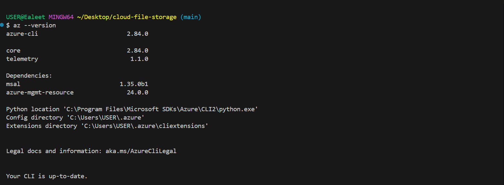
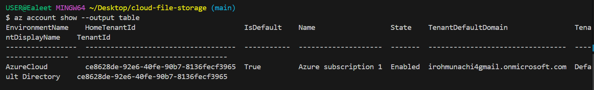
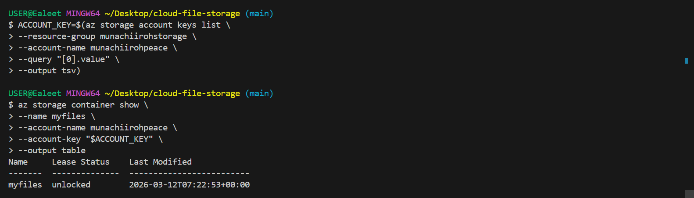
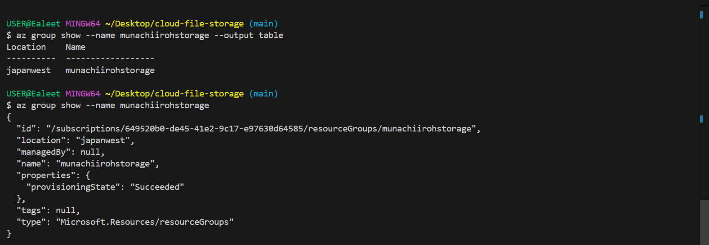
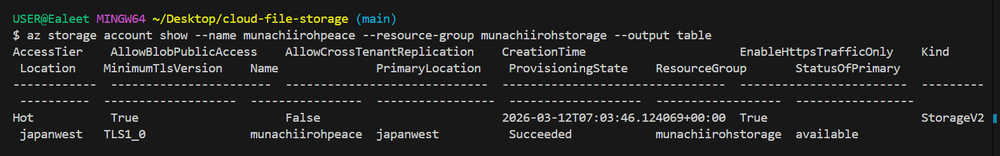
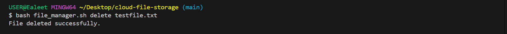
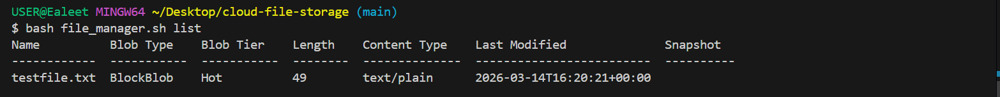
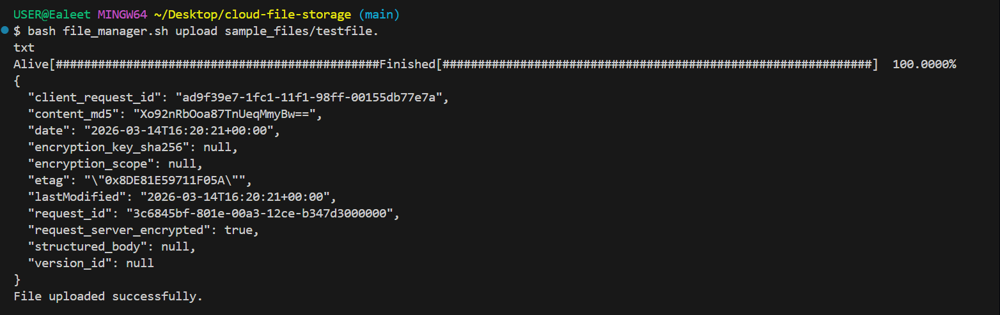
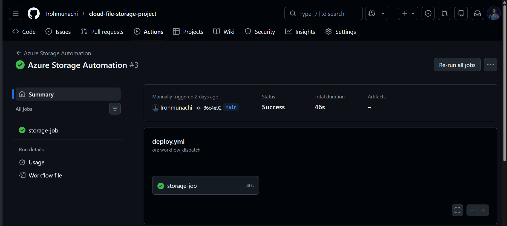

# Simple Cloud-Based File Storage with Bash and Azure CLI

## Project Overview
This project is a simple cloud-based file storage system built using Bash scripting and Azure CLI. It uses Azure Blob Storage as the cloud storage backend.

## Features
- Create Azure resource group
- Create Azure storage account
- Create blob container with public access
- Upload files
- List files
- Download files
- Delete files
- Log storage actions with timestamps

## Files
- `deploy.sh` - deploys the Azure infrastructure
- `file_manager.sh` - manages file operations
- `config.env` - stores configuration values
- `logs/storage.log` - stores activity logs

## Deployment
Run:

```bash
bash deploy.sh

```

## Screenshots
### Azure CLI


### Azure Login Show


### Blob Container


### Resource Group


### Storage Account


### Delete Success


### Download Success


### List Success


### Upload List Success


### GitHub Run Azure Storage


### GitHub Azure Storage


## Conclusion
This project demostrates how Bash Scripting, Azure CLI, Azure Blob Storage, and GitHub Actions can be combined to automate cloud storage deployment and file management.
